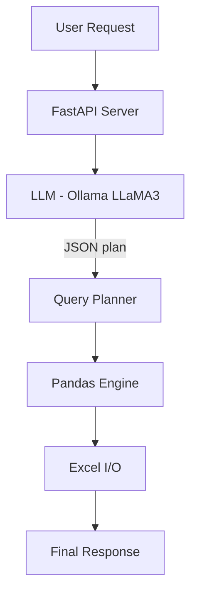

# 📊 Excel-AI Engine — LLM Powered Excel Data Intelligence System

### ✨ Natural-Language Data Analysis | Excel Automation | AI-Driven Insights

> Upload any Excel file → Ask questions in English → Get SQL-like results, summaries, pivots, filters, joins & insights powered by LLMs.

---

## 🚀 Key Features

| Capability | Details |
|---|---|
🧠 LLM-Powered Query Understanding | Convert natural language into structured data ops  
📁 Excel File Upload | Works with any `.xlsx` file  
📊 Structured Data Analysis | Filters, aggregations, joins, pivots, math ops  
📅 Date Operations | Extract year/month/day, time diff  
🗣️ Optional Text Intelligence | Summaries, sentiment (LLM-based)  
🖧 REST APIs | `/upload`, `/query/run`  
⚙️ Local AI | Works fully offline via **Ollama + LLaMA3**  
💡 Auto Sample Excel Generator | 1000+ rows structured and unstructured data 

---


## 🧠 Tech Stack

| Component | Tool |
|---|---|
Language | Python 3.10+
Backend | FastAPI
Compute | Pandas, OpenPyXL
LLM | Ollama — LLaMA3
Runtime | Uvicorn
Mode | CLI + REST API

---

## 🏗 System Architecture


##📁 Folder Structure
## 📁 Folder Structure

```text
excel-ai-engine/
├── app/
│   ├── main.py                # FastAPI entry point
│   ├── router.py              # API routing
│   ├── llm_agent/
│   │   ├── __init__.py
│   │   └── llm_agent.py       # LLM interface (Ollama / OpenAI / etc.)
│   └── services/
│       ├── orchestrator.py    # NL query → operation planner
│       └── excel_processor.py # Pandas Excel operations
├── data/                      # Generated Excel files stored here
├── cli_orchestrator.py        # CLI mode for running natural queries
└── README.md                  # Documentation
## 🚀 Quick Start
```
### 1️⃣ Clone the repo
```bash
git clone https://github.com/YOUR_USERNAME/excel-ai-engine.git
cd excel-ai-engine

```
### 2️⃣ Create virtual environment
```python -m venv venv
source venv/bin/activate      # macOS/Linux
venv\Scripts\activate         # Windows
```
### 3️⃣ Install dependencies
```
pip install -r requirements.txt
```
### 4️⃣ Install & pull LLaMA3 model (Ollama)
Download Ollama 👉 https://ollama.com/download
Then pull the model:
```
ollama pull llama3
```
### 5️⃣ Run the server
```
uvicorn app.main:app --reload
```
